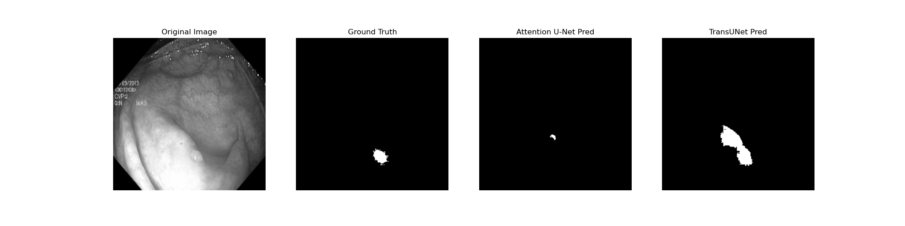

# Medical Image Segmentation using Transformer-based Architectures

This project implements and compares **Attention U-Net** and **TransUNet** for medical image segmentation tasks.

## Objectives
- Implement state-of-the-art transformer-based architectures for medical imaging.
- Compare performance between Attention-gated CNNs and Vision Transformers.
- Provide a robust pipeline for preprocessing, training, and evaluation.

## Architecture
### 1. Attention U-Net
Injects Attention Gates into the standard U-Net skip connections to filter irrelevant features and focus on salient regions.

### 2. TransUNet
Combines the strong local feature extraction of CNNs with the global context modeling of Transformers. It uses a ViT as a bottleneck in a U-Net-like structure.

## Folder Structure
```
Medical-Segmentation-Transformers
│
├── dataset/             # (Not included, add your images/masks here)
├── models/              # Architecture implementations
├── preprocessing/       # Augmentation and normalization
├── training/            # Loss functions and training loop
├── evaluation/          # Metrics and evaluation scripts
├── visualization/       # Result visualization
├── utils/               # Data loaders
├── notebooks/           # Experiment notebooks
└── requirements.txt     # Dependencies
```

## Getting Started
1. **Install dependencies**:
   ```bash
   pip install -r requirements.txt
   ```
2. **Prepare Data**:
   Place your medical scans in `dataset/images` and masks in `dataset/masks`.
3. **Train Model**:
   ```bash
   python training/train.py --model transunet --epochs 20 --batch_size 16
   ```
4. **Evaluate and Compare**:
   ```bash
   python evaluation/evaluate.py
   ```

## Results and Comparison

We compared Attention U-Net and TransUNet on the Kvasir-SEG dataset. Attention U-Net significantly outperformed TransUNet in our experiments, likely due to better alignment with the specific dataset characteristics or more optimal training convergence.

| Model | Dice Coefficient | IoU | Precision | Recall |
|-------|------------------|-----|-----------|--------|
| Attention U-Net | 0.658 | 0.509 | 0.819 | 0.577 |
| TransUNet | 0.153 | 0.087 | 0.759 | 0.090 |

### Qualitative Comparison
Below is a sample comparison of original scans, ground truth masks, and predictions from both models:



## Evaluation Metrics Used
- **Dice Coefficient**: Measures the overlap between the prediction and the ground truth.
- **Intersection over Union (IoU)**: Also known as the Jaccard index.
- **Precision & Recall**: Helps understand the balance between over-segmentation and under-segmentation.

## Author
[Your Name/Hima]
